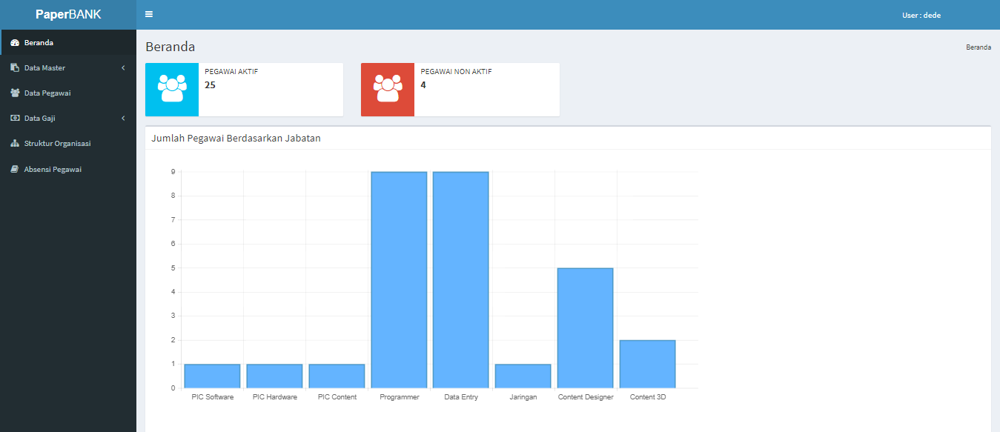
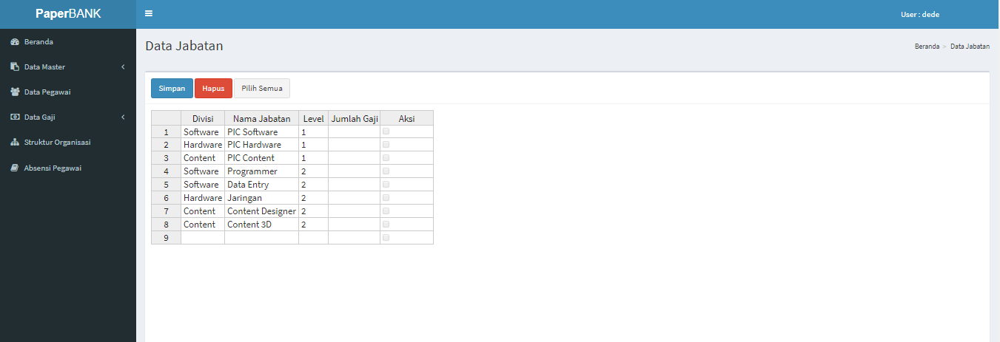
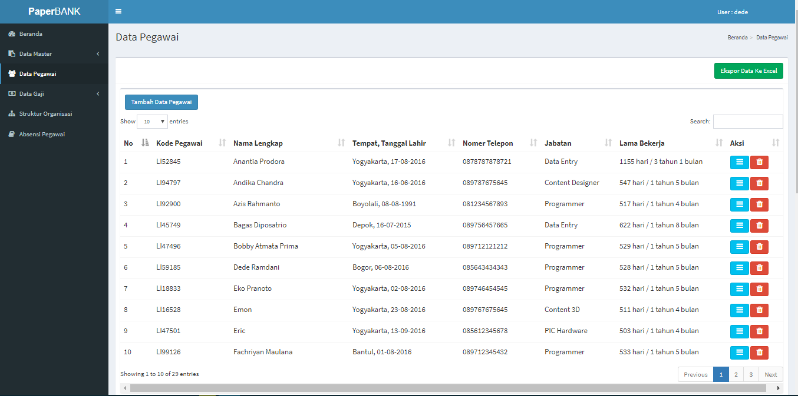
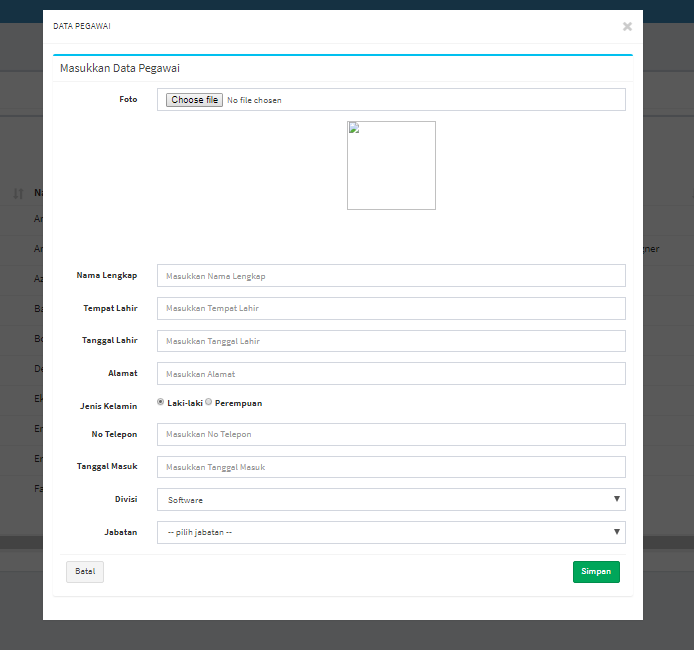
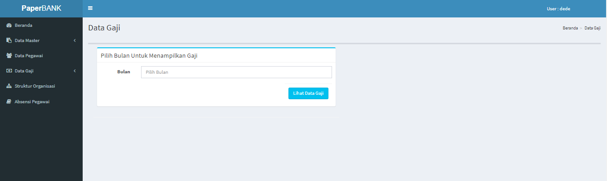
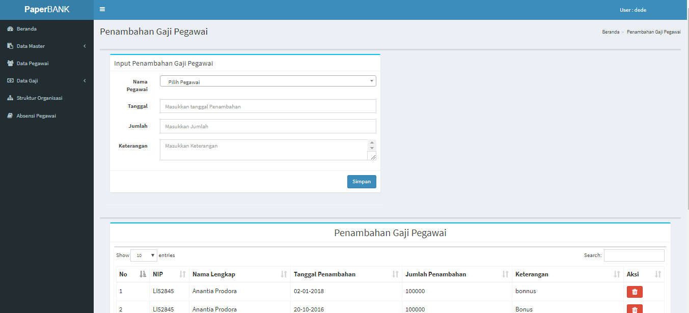
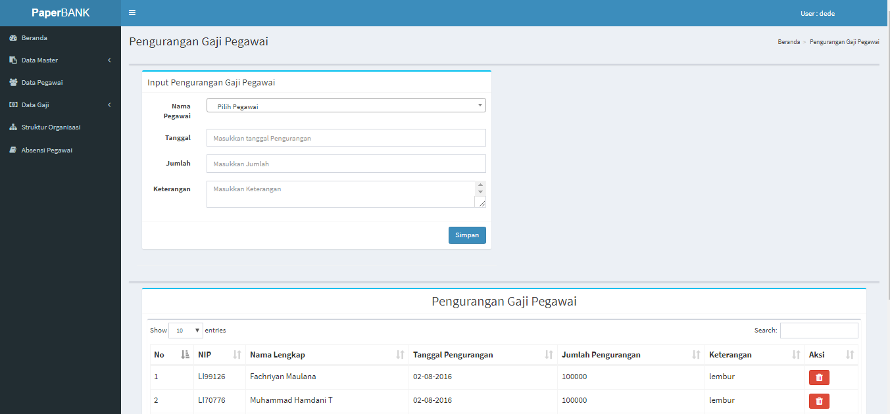
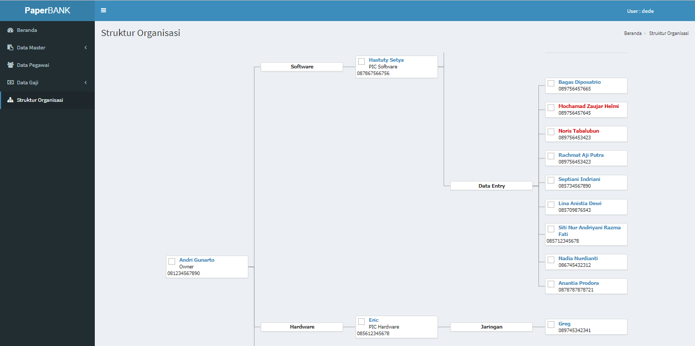

# Sistem Informasi Kepegawaian

Ini merupakan aplikasi yang saya buat pada saat melaksanakan Prakerin(Praktek Kerja Industri) yang berfungsi untuk mendukung sistem administrasi pada suatu perusahaan yang masih menggunakan sistem konvesional menjadi lebih ter-komputerisasi

# -Tampilan Utama

# -Master Data

# -Data Pegawai

# -Pop-up Tambah Data

# -Data Gaji

# -Penambahan data gaji

# -Pengurangan data gaji

# -Struktur 

